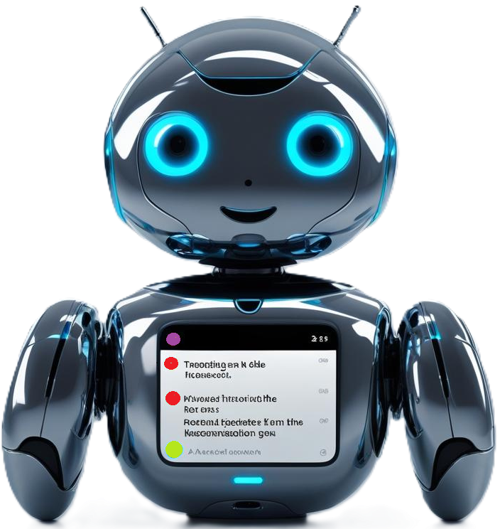

<p align="center" width="10%">
    </a>
</p>

# <p align="center">Chat Relay Bot<br>(Kick + YouTube → Twitch)</p>

<br><p align="center" width="100%">
<a href="https://www.buymeacoffee.com/kimsec">
</a></p>

## Description
A small asynchronous relay that **reads chat messages from Kick and YouTube** and **posts them into a Twitch chat** via the official Helix `chat/messages` endpoint.  
This repo contains the bot itself and a minimal OAuth helper to obtain and refresh Twitch tokens.

> **Heads‑up:** Keep your secrets out of Git. Use `.env` (not committed) and the provided `.env.example` as a template.

---

## Features

- ✅ Relays **Kick** and **YouTube Live Chat** messages into **Twitch**.
- ✅ Uses Twitch **Helix** `POST /helix/chat/messages` (no IRC).
- ✅ **Auto‑refresh** of Twitch access token at runtime (after first OAuth).
- ✅ Optional prefixes (e.g., `🟢[KICK] `, `🔴[YT] `) so you can tell sources apart.
- ✅ Works fine under **systemd** for 24/7 operation.
- ✅ OAuth helper (`auth_server.py`) to securely obtain tokens.

---

## Repository layout

```
chatbot.py        # The relay bot (Kick/YouTube -> Twitch)
auth_server.py    # Tiny OAuth2 web app to obtain/refresh Twitch tokens
.env.example      # Environment variable template (no secrets)
requirements.txt  # Python dependencies
.gitignore        # Ignores secrets and local files
```

---

## Requirements

- **Python 3.10+** (tested on 3.12)
- A **Twitch Developer Application** (Client ID + Client Secret)
- A **YouTube Data API v3** key
- (Production) An **HTTPS** endpoint for the OAuth callback (e.g., Cloudflare Tunnel)

---

## Installation

```bash
# clone & enter the repo
git clone <your-repo-url>
cd <repo>

# (recommended) virtual environment
python3 -m venv .venv
source .venv/bin/activate

# dependencies
pip install -r requirements.txt
```

Create your env file from the template and fill it out:

```bash
cp .env.example .env
```

---

## Environment variables

### Twitch (bot runtime)
- `TWITCH_CLIENT_ID` / `TWITCH_CLIENT_SECRET` – from your Twitch Dev app.
- `TWITCH_SCOPES` – leave as `user:write:chat user:bot`.
- `TWITCH_TOKENS_FILE` – path to token cache file (default `twitch_tokens.json`).
- `TWITCH_BOT_TOKEN` / `TWITCH_REFRESH_TOKEN` / `TWITCH_TOKEN_EXPIRES_AT` – **populated automatically** after you authorize via `auth_server.py`.
- `TWITCH_BROADCASTER_ID` – the **channel user ID** that receives messages.
- `TWITCH_SENDER_ID` – the **bot account user ID** that posts the messages (can be same as broadcaster).

> After successful OAuth, the helper page shows the logged-in username and `user_id`.  
> If you want the bot to post **as the channel owner**, set both IDs to that same user ID.

### YouTube
- `YOUTUBE_API_KEY` – your Data API v3 key.
- `YOUTUBE_CHANNEL_ID` – the canonical channel ID (`UC…`), **recommended**.
- `YOUTUBE_CHANNEL_HANDLE` – optional fallback handle (e.g., `@yourhandle`).
- `YOUTUBE_LIVE_CHAT_ID` – use `AUTO` so the bot resolves the current live chat automatically.
- `YOUTUBE_VIDEO_ID` – set only when testing **unlisted** streams (directly resolve that video’s chat).
- `ENABLE_YT` / `ENABLE_KICK` – `true` / `false` toggles.
- `KICK_CHANNEL` – Kick username.
- `YT_MIN_POLL_MS` – minimum wait between YouTube chat polls (e.g., `15000` = 15s).

### OAuth helper (auth_server.py)
- `AUTH_BIND_HOST` – usually `127.0.0.1` in production.
- `AUTH_PUBLIC_BASE` – the **public base URL** (HTTPS) that Twitch will redirect to, e.g. `https://twitch-auth.example.com`.

---

## Twitch OAuth (first‑time setup)

1) **Set an OAuth Redirect URL** in your Twitch Developer app:
   - Local testing: `http://localhost:3750/callback`
   - Production: `https://twitch-auth.example.com/callback` (must be HTTPS)

2) **Run the OAuth helper**:
   ```bash
   python auth_server.py
   ```

3) **Open**:
   - Local: `http://localhost:3750/login`
   - Prod:  `https://twitch-auth.example.com/login`

   Login & authorize → you should see **“Bot authorized ✅”**.  
   The helper writes `TWITCH_BOT_TOKEN`, `TWITCH_REFRESH_TOKEN`, `TWITCH_TOKEN_EXPIRES_AT` into `.env` and also stores them in `twitch_tokens.json`.

4) Stop the helper (Ctrl+C). You only need it again if you need to re‑authorize.

> The bot code automatically **refreshes** the access token while running using the refresh token.

---

## Running the bot

### Local
```bash
python chatbot.py
```

### Systemd (recommended)

Create `/etc/systemd/system/chatbot.service`:

```ini
[Unit]
Description=Chat Relay Bot (Kick + YouTube -> Twitch)
After=network-online.target
Wants=network-online.target

[Service]
User=<your-linux-user>
Group=<your-linux-user>
WorkingDirectory=/full/path/to/repo
Environment="PYTHONUNBUFFERED=1"
ExecStart=/full/path/to/repo/.venv/bin/python /full/path/to/repo/chatbot.py
Restart=always
RestartSec=3

[Install]
WantedBy=multi-user.target
```

Enable & start:

```bash
sudo systemctl daemon-reload
sudo systemctl enable --now chatbot.service
journalctl -u chatbot.service -f
```

---

## How it works (short)

- **Kick → Twitch:** Uses `kickpython` to read chat; forwards each message to Twitch (1 msg/sec to respect limits).
- **YouTube → Twitch:** Resolves the active live chat (`activeLiveChatId`) and polls `liveChatMessages.list`; forwards messages to Twitch.
- **Twitch posting:** Uses Helix `POST /helix/chat/messages` with your bot user token. Messages are trimmed to **500 chars** and rate‑limited to **1 msg/sec** per channel.

> For YouTube: public live discovery uses `search.list` (quota‑heavy). For **unlisted/private testing**, set `YOUTUBE_VIDEO_ID` to skip the search and resolve the chat directly.

---

## Quota & Intervals (YouTube)

- Discovery (`search.list`): expensive. Check infrequently (e.g., every 10–15 minutes) when idle.
- Chat polling (`liveChatMessages.list`): set a sensible floor via `YT_MIN_POLL_MS` (e.g., 10–15 seconds) to stay within the default 10k daily quota.

If you hit **`quotaExceeded` (403)**, increase intervals or wait until the daily reset.

---

## Troubleshooting

- **Twitch 401/403** – Re‑run `auth_server.py` and authorize again.
- **YouTube live not found** – Ensure the stream is **public** and chat is enabled; for unlisted testing, define `YOUTUBE_VIDEO_ID`.
- **Kick import error** – `pip install curl_cffi websockets kickpython`.
- **Slow relay** – Twitch is limited to 1 message/sec; bursts are queued and delivered in order.

Logs:
```bash
journalctl -u chatbot.service -n 200 --no-pager
```

---

## Security Notes

- **Never commit** `.env` or `twitch_tokens.json` (already ignored in `.gitignore`).
- Regenerate **Client Secret** / **API keys** if they were exposed.
- Use **HTTPS** for the OAuth callback in production (Cloudflare Tunnel works great).

---
